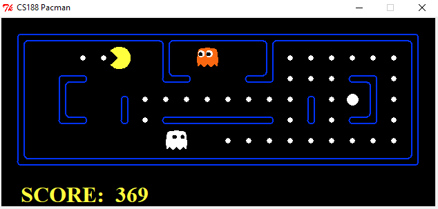

# Pacman Multiagent

Pacman solved with the Minimax algorithm for adversial search. Also solved with Alpha-Beta Pruning in order to speed up the search.

My implementations are done in the file `multiAgents.py`.

**Note:** This code runs on Python 2.

